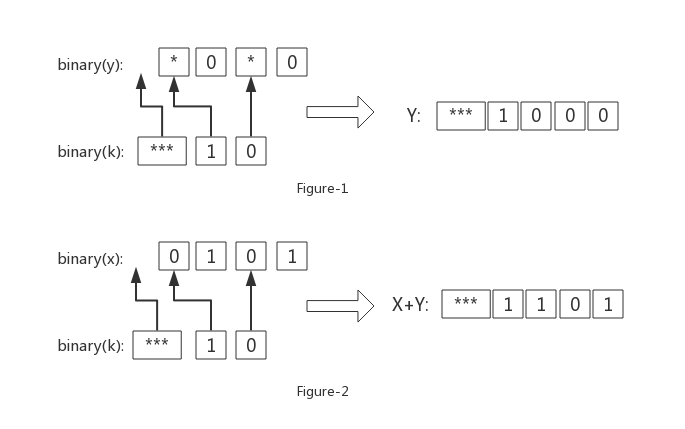

# **Or and Plus**

## **1. Question:**

Given x, k , find the k-th positive integer y that satisfies x + y = x | y . 

| is a binary or (or) operation, for example 3 | 5 = 7.

**Example:**
    
    input: 5 1
    output: 2

## **2. Thinking:**

**Fisrt Step**, we need to know the difference between "+" and "|". Refer to the following example:

     x   y
    01 + 01 => 10 (x+y)
    01 | 01 => 01 (x|y)

    Notice: number is binary

Obviously, when 1 appears in the same bit of y and x, "+" will produce a carry, and "|" has no effect on the result. Therefore, if you want to find a number y and x + y = x | y, x and y need to meet the following condition:

*Condition-1: If the i-th bit of binary(x) is 1, the i-th bit of binary(y) must be 0.*

notice: binary(N) is N's binary number.

**Second Step**, we need to think about how to get k-th y. Refer to the following example: 
    
    x = 5
    binary(x) = 0101 
    binary(y) = *0*0, based on Condition-1

Accoding to the value of k, we can get the Table-1 by enumeration.

|y     |*val|k   |
|:----:|:--:|:--:|
|\*0\*0|* * | any (decimal)|
|0010  |0 1 |  1 |
|1000  |1 0 |  2 |
|1010  |1 1 |  3 |
Table-1: relationship of y and k

Accoding to the Table-1, we find the *val equels to k. That means, we are very close to a good solution, which builds y by k's value.

**Notice:** number is binary, and '*' indicates uncertainty.

## **3. Solution:**

**Direct Solution:** As show in Figure-1, from low to high, replace * in y with each bit of binary(k). If the binary(k) is too long, it is added directly to the head of y.

However, the process of getting y (like this form: \*0\*0) is  inconvenient. Therefore, we can use an Easier Solution.

**Easier Solution:** As show in Figure-2, from low to high, replace 0 in x with each bit of binary(k). If binary(k) is too long, it is added directly to the head of x. Then, we can get the value of x+y. Finally, subtract x from x+y.



**Notice:** Figure-1 and Figure-2 are example of x = 5, which is same as Second Step in Thinking.

**Complexity Analysis:**
    
- Time complexity: O(m+n), we just need to visit binary(x) and binary(k)
- Space complexity: O(1)

    Notice: m = length(binary(x)) , n = length(binary(k)), and length() can return number of digits.

## **4. Coding**

This is a code example that uses string operations.
But if you use bit operations, it will be more efficient.

```python
while True:
try:
    x,k = input().split()
    x = int(x)
    k = int(k)
    # 分析bit，y中不能包含x的bit位
    k_bin_l = list(bin(k)[2:])
    x_bin_l = list(bin(x)[2:])
    i = len(x_bin_l)-1
    j = len(k_bin_l)-1
    while i>=0:
        if x_bin_l[i]=='0':
            if j>=0:
                x_bin_l[i]=k_bin_l[j]
                j=j-1
        i=i-1
    l = j
    while l>=0:
        x_bin_l.insert(0,k_bin_l[l])
        l=l-1
    y = int("".join(x_bin_l),2)-x
    print(y)
except:
    break
```